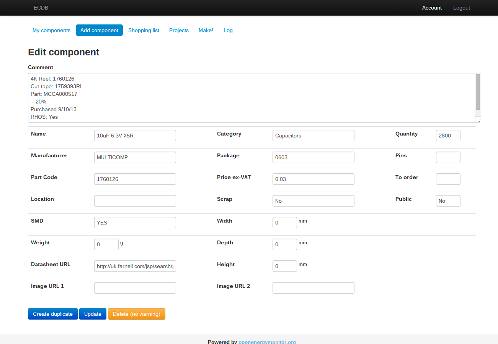

# Emon ecDB

Custom Electronic Component Database PHP Web-App using Emoncms model view controller framework 

Based on ecDB developed by Nils Fredriksson (https://github.com/ElectricMan/ecDB)

Modified by @trystanlea to use Emoncms model view controller framework. 

* Keep track of component stock count, cost, datasheet links, notes etc. 
* Create projects containing a number different components and calculate total cost
* Calcualte total cost value of components in stock
* Work out how many of each project can be manufactured with current component stock
* Identify component stock bottle necks
* Create shipping list of components

